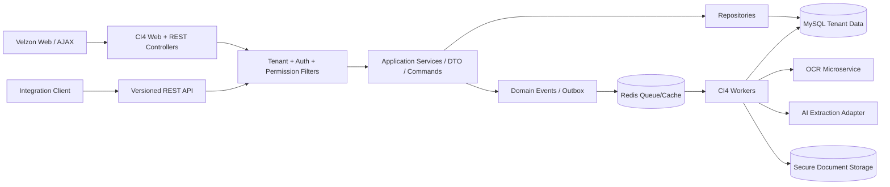

# ERP Enterprise Blueprint

## 1. Executive Scope

Pena ERP adalah platform web modular untuk distributor, trading, retail,
gudang, jasa, holding, dan manufacturing ringan. Platform menyatukan purchasing,
sales, stock, finance, HRM, light production, QC, POS, reporting, approval, dan
document ingestion berbasis OCR/AI di bawah isolasi tenant yang konsisten.

Target production:

- Multi-company dan multi-branch pada shared SaaS application.
- Gudang, user, role, permission, approval, audit dan numbering per tenant.
- Input transaksi manual maupun draft dari PO, invoice, delivery order,
  receipt, surat jalan, faktur, scan, foto HP, dan PDF.
- API-ready, queue-ready, OCR microservice-ready, dan dapat ditingkatkan dari
  single database menjadi sharded tenancy.

## 2. Technology Baseline

| Area | Baseline | Keputusan Implementasi |
| --- | --- | --- |
| Runtime | PHP `^8.2`, Composer | Dev bootstrap terverifikasi pada PHP 8.2.12; production menggunakan PHP-FPM |
| Backend | CodeIgniter 4 `^4.7` | Appstarter/framework telah dikunci pada `4.7.3` pada Tahap 1 |
| Presentation | Velzon CI4, Bootstrap 5, SCSS, jQuery/AJAX | Layout dan asset hanya pada presentation layer |
| Data grid/chart | DataTables, ApexCharts | Endpoint server-side untuk dataset besar |
| Database | MySQL 8.0 atau MariaDB setara | InnoDB, `utf8mb4`, timezone UTC, decimal finance |
| Authentication | CodeIgniter Shield `^1.3` via adapter | Shield `v1.3.0` terpasang pada Tahap 2; domain tetap melalui `AuthGatewayInterface` |
| Cache/queue | Redis | Cache, rate-limit, distributed lock dan queue transport |
| OCR | PaddleOCR primary, Tesseract fallback | Python OCR service terpisah; PHP tidak mengeksekusi file user langsung |
| LLM | Provider adapter (OpenAI-ready) | Structured JSON extraction, redaction, audit, confidence threshold |
| Storage | Private object storage/local encrypted volume | Pre-signed/download controller berizin; tidak di public web root |
| Web server | Nginx atau Apache + PHP-FPM | TLS, upload limits, request IDs dan security headers |

Keputusan autentikasi: walau requirement awal menyebut Myth/Auth, implementasi
proyek baru ini memakai CodeIgniter Shield yang direkomendasikan oleh ekosistem
CI4. Shield menangani identity dan session authentication. Group Shield hanya
dipakai untuk otorisasi platform; role operasional tenant tetap berada pada
tabel membership/RBAC ERP agar scope multi-company dan multi-branch terjaga.
Domain application tidak boleh memanggil package auth langsung; akses dilakukan
melalui `AuthGatewayInterface`.

## 3. Logical Architecture

### Layer Contract

| Layer | Responsibility | Larangan |
| --- | --- | --- |
| Presentation | Controllers, API resources, views, AJAX validation | Tidak mengandung posting ledger atau SQL |
| Application | Service, DTO, command handlers, workflow orchestration | Tidak membaca request/session langsung |
| Domain | Entity/value objects, rules, events | Tidak tahu CI4/Velzon/OCR provider |
| Infrastructure | Repository CI4, Redis, storage, OCR/LLM clients | Tidak menentukan business approval |

## 4. Module Boundaries

| Module | Ownership Utama | Emits / Consumes |
| --- | --- | --- |
| Auth, Users, Roles | Identity, tenant membership, permission matrix | `UserAuthenticated`, `RoleAssigned` |
| Company, Branch, Settings | Tenant, branch, fiscal/numbering config | `CompanyActivated` |
| Dashboard, Reports | Read models/KPI, export | Consume transaksi/events |
| Inventory | Product, UOM, warehouse, lot, movement, valuation | `StockReserved`, `StockPosted` |
| Purchasing | Supplier, requisition, PO, GRN, AP invoice | `PurchaseInvoiceApproved` |
| Sales, POS | Customer, order, delivery, invoice, cashier shift | `SalesInvoicePosted` |
| Accounting, CashBank | COA, journal, AR/AP, payment, bank reconciliation | Consume posting events |
| HRM | Employee, attendance, payroll summary | `PayrollApproved` |
| Production, QC | BOM, work order, consumption, finished goods, inspection | Stock events |
| Workflow, Notifications | Approval instances, inbox, email/in-app messages | Consume all approval requests |
| DocumentProcessing, OCR, AI | Upload, OCR, structured mapping, draft generation | `DocumentValidated`, `DraftCreated` |

Cross-module writes terjadi melalui application service atau event consumer,
bukan controller yang menulis tabel modul lain.

## 5. Multi-Company and SaaS Isolation

### Tenancy Model

Fase awal memakai shared database/shared schema dengan `company_id` wajib pada
semua tenant-owned record. `branch_id` wajib untuk operasional yang berlangsung
di cabang atau gudang. Global platform tables hanya `tenants/plans`, queue
operational metadata, dan reference non-sensitive yang jelas ditetapkan.

Request lifecycle:

1. Session/token diotentikasi melalui auth adapter.
2. User memilih active company/branch dari membership yang sah.
3. `TenantContextFilter` membuat immutable `TenantContext(companyId, branchId,
   userId)`.
4. Repository menyertakan scope `company_id` dari context pada query, insert,
   update, lookup duplicate, report, dan export.
5. Policy memeriksa permission dan optional branch restriction.
6. Audit writer merekam actor, tenant, request ID dan perubahan penting.

Aturan data:

- Unique business key menggunakan komposit tenant, misalnya
  `UNIQUE(company_id, invoice_no, supplier_id)`.
- Tidak ada IDOR: URL `/{id}` selalu diload melalui tenant-scoped repository.
- Super admin platform menggunakan elevation ter-audit, bukan melewati filter
  secara diam-diam.
- File storage path menggunakan opaque object key, bukan nama tenant/user input.
- Opsi enterprise berikutnya: dedicated database per tenant besar melalui
  `TenantConnectionResolver`, tanpa mengganti kontrak repository.

### Company and Branch Switching

`user_company_memberships` menyatakan akses company, sedangkan
`user_branch_memberships` membatasi cabang. Pergantian context menghapus cache
menu/dashboard tenant lama dan menerbitkan audit `TENANT_CONTEXT_CHANGED`.

## 6. User, Role and Permission Architecture

Role awal: `super_admin`, `owner`, `finance`, `accounting`, `purchasing`,
`warehouse`, `sales`, `cashier`, `hr`, `manager`, dan `staff`. Role custom
tersimpan per company; permission bersifat granular, misalnya:

| Resource | Permission Examples |
| --- | --- |
| Purchasing | `purchasing.po.view`, `.create`, `.approve`, `.cancel` |
| Inventory | `inventory.stock.view`, `.adjust`, `.transfer.approve` |
| Finance | `finance.invoice.post`, `finance.journal.reverse`, `bank.reconcile` |
| AI documents | `documents.upload`, `.validate`, `.override_confidence` |
| Administration | `company.settings.edit`, `roles.manage`, `audit.view` |

Enforcement:

- Shield mengurus identity/session, activation/reset atau magic-link policy,
  serta login throttling.
- Tabel ERP menambahkan tenant membership, custom role, permission, menu dan
  approval authority di atas identity provider.
- `PermissionFilter` melakukan coarse route check; service policy tetap
  memeriksa branch, amount limit, segregation of duty dan document state.
- Approval tidak boleh dilakukan user yang membuat transaksi untuk rule yang
  menetapkan four-eyes control.
- Menu Velzon hanya presentational visibility; backend permission tetap wajib.

## 7. Security and Compliance Controls

| Concern | Control Minimum |
| --- | --- |
| CSRF/XSS | CI4 CSRF cookie/session, rotated token for AJAX; auto escaping view; CSP |
| SQL injection | Query Builder/prepared statements; no client column/order without allow-list |
| Session | Secure/HttpOnly/SameSite cookie, session regeneration, inactivity expiry, logout all devices |
| Brute force | Auth throttling + Redis rate limit by user/IP; security audit alerts |
| Upload | MIME sniffing, extension allow-list, size/page limit, malware scan, image re-encode, private storage |
| OCR isolation | Containerized unprivileged worker, no outbound by default, execution timeout/resource cap |
| LLM privacy | Tenant opt-in, redact secrets/PII where required, no arbitrary prompt content, store response audit |
| Ledger integrity | Immutable posted journal; reversal only; approval and period lock |
| Audit | Append-only audit log, request/correlation ID, before/after hash, retention policy |
| Secrets | Environment/secret manager, key rotation, never database/source controlled |
| Backups | Encrypted backups, restore drills, tenant export/deletion governance |

## 8. Non-Functional Requirements

| Dimension | Initial SLO / Rule |
| --- | --- |
| Availability | 99.5% initial; stateless app behind load balancer-ready deployment |
| Web response | P95 read API < 500 ms excluding reports/OCR |
| OCR acceptance | Upload acknowledged < 2 s; async processing with progress |
| Reliability | Idempotency key for upload/API posting and outbox delivery |
| Recovery | Daily full + binlog/incremental; initial RPO 15 min, RTO 4 h |
| Observability | Structured log, request/tenant/job correlation, queue metrics, error alert |
| Retention | Document/audit retention configurable per company/legal policy |

## 9. Development Roadmap

| Phase | Duration Indicative | Deliverables and Exit Criteria |
| --- | --- | --- |
| 0. Foundation | 2-3 weeks | CI4 app, CI pipeline, tenancy context, Shield/auth adapter, Velzon shell, coding standard |
| 1. Core Master + RBAC | 3-4 weeks | company/branch/user/role/menu/audit, products/partners/warehouse, automated isolation tests |
| 2. Commercial MVP | 6-8 weeks | purchasing, inventory, sales, stock movement, base approval, operational reports |
| 3. Finance + POS | 5-7 weeks | COA/journal/AP/AR/payment/cash bank, POS shift/sale, reconciled postings |
| 4. OCR/AI Pilot | 5-7 weeks | secure upload, queue, invoice/PO extraction, draft AP/PO, confidence validation UI |
| 5. Advanced Operations | 5-8 weeks | HRM, production/QC, transfer, executive analytics, notification |
| 6. SaaS Hardening | 4-6 weeks | plans/quotas, tenant onboarding, DR, penetration test, performance and compliance sign-off |

Go-live gate: isolation tests, posting reconciliation, restore drill, upload
security test, model extraction evaluation dataset, audit review, and signed
approval matrix.
