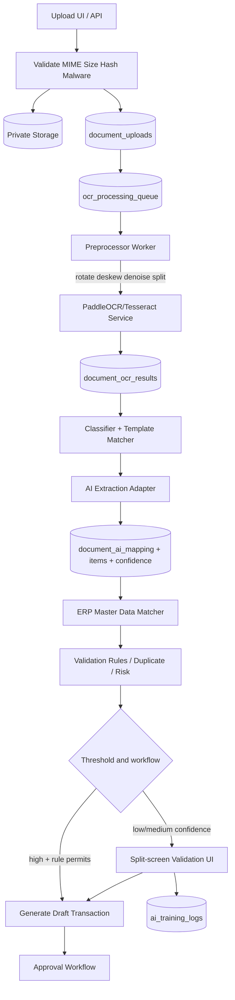
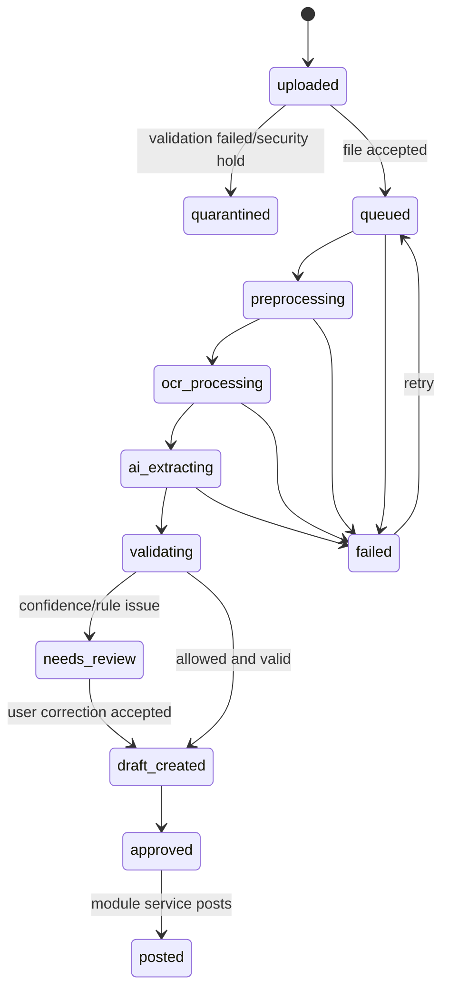

# AI and OCR Document Processing

## 1. Capabilities

Document Processing menerima PDF digital/scan serta gambar JPEG/PNG/WEBP dari
desktop atau kamera ponsel untuk jenis dokumen:

- Purchase order, customer order, supplier/customer invoice.
- Delivery order, receipt, surat jalan dan faktur.
- Dokumen supplier/customer tidak terklasifikasi yang divalidasi user.

Target extraction meliputi document type, nomor dokumen/PO, tanggal, due date,
supplier/customer, mata uang, line item, SKU/deskripsi, kuantitas, UOM, harga,
diskon, tax, subtotal, grand total, alamat dan reference.

Prinsip kendali: AI menghasilkan structured proposal dan draft; business
posting, inventory movement dan journal hanya terjadi setelah aturan validasi
dan approval terpenuhi.

## 2. Processing Architecture



### Deployment Boundary

| Component | Function | Isolation/Scaling |
| --- | --- | --- |
| CI4 upload/application | authorization, metadata, state machine, drafts | Horizontal PHP-FPM; no OCR binary execution |
| Secure storage | original + normalized pages + previews | Private bucket/volume; encryption and retention |
| Queue/Redis | jobs, retries, locks, progress | Separate queues by priority/tenant quota |
| OCR microservice | preprocessing, text, bounding boxes, table cells | Container with CPU/GPU worker, no public route |
| AI extraction service | schema-constrained semantic mapping | Provider adapter, tenant policy, retry/cost cap |
| Validation UI | correction and approval | Permission controlled, immutable source preview |

## 3. State Machine



Statuses disimpan pada `document_uploads`, sementara setiap attempt disimpan di
`ocr_processing_queue` dan validasi pada `document_validation_logs`.

## 4. Ingestion and OCR Pipeline

| Step | Operation | Stored Output | Failure Handling |
| --- | --- | --- | --- |
| Intake | Validate auth, permission, tenant, extension and server-detected MIME | upload record + SHA-256 | Reject or quarantine |
| Security | Malware scan; PDF page limit; strip unsafe metadata; image decode/re-encode | scan result/audit | Quarantine + alert |
| Normalize | PDF page render; auto orientation; deskew; crop; denoise; grayscale/threshold | normalized object keys | Retry bounded |
| OCR | Language selection (`ind`, `eng` configurable), OCR text, boxes and tables | raw JSON/text and engine metadata | fallback engine/manual |
| Classify | document type/template/vendor matching | selected template/type | mark unknown |
| Extract | Structured semantic mapping into strict field schema | mapping JSON/items | manual review |
| Match | Supplier/customer/product/UOM/tax matching | entity IDs + candidates | user resolves mapping |
| Validate | totals, duplicate, tax/date/risk and mandatory fields | rule outcomes/scores | review/approval |
| Draft | call Purchasing/Sales/Inventory service | draft resource ID | never post directly |

OCR text, extracted JSON, normalized pages and model response are versioned;
manual correction does not overwrite the source extraction.

## 5. Extraction Schema

Conceptual schema returned by the AI adapter:

```json
{
  "document_type": "supplier_invoice",
  "header": {
    "document_number": "INV-2026-00051",
    "po_number": "PO-JKT-000103",
    "document_date": "2026-05-22",
    "supplier_name": "PT Sumber Niaga",
    "currency": "IDR",
    "subtotal": 1250000.00,
    "tax_amount": 137500.00,
    "total_amount": 1387500.00
  },
  "items": [
    {
      "line_number": 1,
      "description": "Kertas A4 80 gsm",
      "sku_hint": "ATK-A4-80",
      "qty": 10,
      "uom": "REAM",
      "unit_price": 125000.00,
      "tax_amount": 137500.00,
      "line_total": 1387500.00
    }
  ],
  "field_confidence": {
    "document_number": 0.99,
    "supplier_name": 0.91,
    "items[0].qty": 0.97
  },
  "warnings": []
}
```

Provider output wajib divalidasi terhadap JSON schema, decimal scale, allowed
currency dan tanggal sebelum tersimpan sebagai proposal.

## 6. ERP Mapping Rules

| Extracted Field | Lookup/Mapping | Result |
| --- | --- | --- |
| Supplier/customer name + tax ID | normalized exact match, alias/template, fuzzy candidate | `supplier_id` / `customer_id` or unresolved |
| PO/reference | tenant + partner + open status + number | 3-way match candidate |
| Item code/description | vendor SKU map, barcode, product alias, fuzzy suggestion | `product_id`, no silent create |
| UOM | supplier UOM conversion table | base quantity and conversion |
| Tax | company tax rules + extracted label/rate | tax code/correction flag |
| Currency | company enabled currencies | rate-date requirement |
| Totals | calculated from mapped lines vs header | discrepancy rule |

Draft generation:

- Supplier invoice maps to draft AP invoice and, if applicable, three-way
  matching against PO and goods receipt.
- Customer PO maps to draft sales order.
- Delivery/surat jalan maps to draft goods receipt or delivery confirmation
  selected by direction and partner.
- Receipt maps to cash/bank payment candidate requiring finance validation.

## 7. Confidence and Validation

### Confidence Computation

`document_confidence_scores` menyimpan score per field dan summary. Initial
policy:

| Condition | Action |
| --- | --- |
| Required field missing or suspicious file/security rule | Block/quarantine |
| Duplicate strong match | Block draft; user resolves duplicate |
| Header >= 0.97, item fields >= 0.95, totals pass, known supplier and reference | May create draft automatically |
| Score 0.75 to threshold or discrepancy within tolerance | Create review task |
| Score < 0.75, unknown supplier, tax/amount discrepancy | Mandatory finance/purchasing review |

Threshold bersifat konfigurasi company dan dievaluasi ulang dari hasil pilot,
bukan dianggap akurasi final.

### Validation Rule Set

| Rule Code | Validation | Severity |
| --- | --- | --- |
| `DUP_HASH` | SHA-256 file pernah diproses tenant yang sama | block/review |
| `DUP_DOC_NO` | supplier + invoice number + amount/date match existing | block |
| `PARTNER_UNKNOWN` | partner belum matched/approved | block |
| `TOTAL_MISMATCH` | sum lines + tax differs from total beyond tolerance | block |
| `PO_MISMATCH` | price/qty exceeds PO/receipt tolerance | approval |
| `TAX_INVALID` | tax code/rate inconsistent with company setting | approval |
| `DATE_PERIOD_LOCKED` | transaction date within accounting locked period | block |
| `RISK_NEW_BANK` | supplier bank changes detected | dual approval |

Basic fraud indicators are rules and signals, not fraud determinations. They
must produce an auditable review case and cannot autonomously accuse a party.

## 8. Learning and Corrections

When a reviewer changes an extracted field:

1. Store original, corrected value, bounding region, template and reviewer in
   `ai_training_logs`.
2. Store repeatable vendor aliases/item mappings in `ai_field_mapping` only
   after permitted confirmation.
3. Update `document_templates` only through approved template versioning.
4. Periodically create anonymized/evaluated dataset and measure field accuracy,
   straight-through draft rate and false duplicate rate.
5. Deployment of changed prompt/model/template uses version and rollback; it
   never trains a third-party model implicitly with tenant document data.

## 9. Queue Design

Jobs use idempotency `(company_id, document_upload_id, processing_stage,
attempt_group)`. Queues:

| Queue | Payload | Retry/Timeout |
| --- | --- | --- |
| `document.preprocess` | object key, page policy | 2 retry, 2 minutes |
| `document.ocr` | normalized pages, language hints | 3 retry, per-page timeout |
| `document.extract` | OCR result ID, template version | 2 retry, provider timeout |
| `document.validate` | mapping version | 1 retry; deterministic |
| `document.draft` | validated mapping and target module | idempotent once |
| `notification.send` | workflow/result alert | exponential retry |

Dead-letter records remain searchable on the OCR dashboard. Tenant quotas cap
concurrent pages and LLM costs so one company cannot exhaust shared service.

## 10. Validation User Interface

Split-screen editor:

- Left pane: immutable PDF/image page preview, zoom, rotate display, OCR
  bounding-box highlight.
- Right pane: mapped header and editable line table, candidate supplier/product,
  confidence badges, discrepancy messages and approval timeline.
- Toolbar: reprocess, apply template, save correction, create draft, reject,
  request approval; every action permission and audit controlled.

Dashboard cards: queued/running/failed/needs review/approved documents, average
processing duration, confidence distribution, duplicate blocks, user correction
rate, and consumption by tenant.

