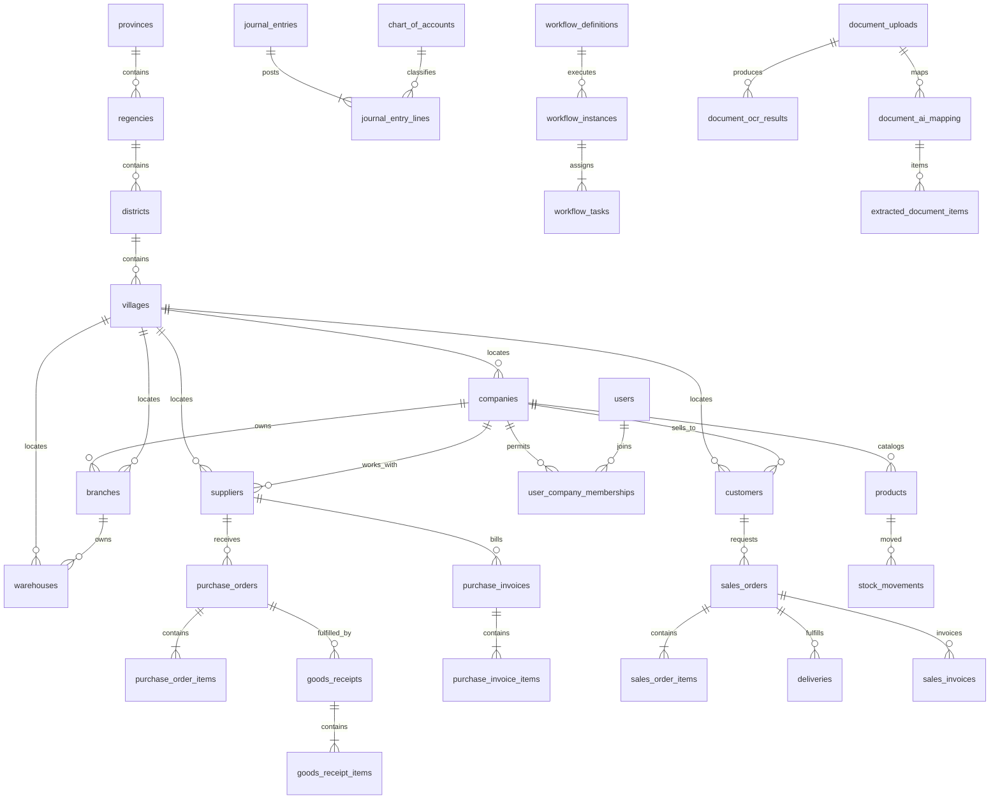
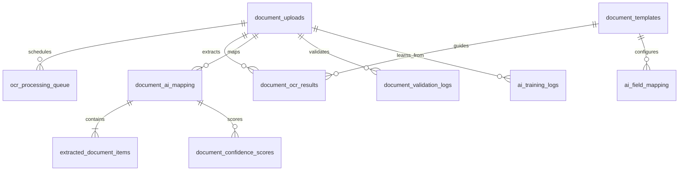

# Data Model and Table Catalog

## 1. Database Standards

Database target adalah MySQL 8.0/MariaDB compatible, InnoDB, `utf8mb4`, UTC,
dan naming `snake_case`. ID menggunakan `BIGINT UNSIGNED AUTO_INCREMENT`.
Nominal menggunakan `DECIMAL(19,4)`, quantity `DECIMAL(18,4)`, rate
`DECIMAL(9,6)`, tanggal bisnis `DATE`, dan waktu audit `DATETIME NULL`.

### Mandatory Tenant and Audit Columns

Notation `T+A` pada katalog berarti tabel menyertakan seluruh kolom berikut.
Field ini merupakan bagian dokumentasi setiap tabel bertanda tersebut:

| Field | Type/Key | Purpose and Index |
| --- | --- | --- |
| `company_id` | `BIGINT UNSIGNED NOT NULL FK companies.id` | Tenant isolation; first column pada index tenant/business key |
| `branch_id` | `BIGINT UNSIGNED NULL FK branches.id` | Scope cabang bila operasional; index bersama `company_id` |
| `created_at` | `DATETIME NOT NULL` | Waktu create UTC |
| `updated_at` | `DATETIME NULL` | Waktu perubahan UTC |
| `deleted_at` | `DATETIME NULL` | Soft delete; filter default `IS NULL` |
| `created_by` | `INT UNSIGNED NULL FK users.id` | Actor create/system nullable; follows Shield user key |
| `updated_by` | `INT UNSIGNED NULL FK users.id` | Actor terakhir; follows Shield user key |

Tabel platform/auth provider dan reference tertentu bertanda `G` bersifat
global dan tidak memiliki `company_id`; tenant access untuk user disimpan pada
membership. Master wilayah `G` hanya dikelola oleh proses platform/import
versioned, bukan oleh masing-masing tenant.
Tabel tenant hanya dapat diakses repository dengan `TenantContext`.

### Reference Field Rules

| Pattern | Type/Meaning |
| --- | --- |
| `id` | Primary key kecuali disebut lain |
| `*_id FK x.id` | Foreign key `BIGINT UNSIGNED`, restrict untuk master digunakan transaksi |
| `status` | `VARCHAR(30)` dengan state validation pada service/DB check bila tersedia |
| `code`, `number` | `VARCHAR(50)` dan unique di dalam company/branch sesuai proses |
| JSON fields | `JSON`; schema diverifikasi application service, bukan arbitrary payload |

## 2. High-Level ERD

## 3. Platform, Reference, Tenant, Identity and Authorization

Semua tabel pada bagian ini `T+A`, kecuali yang diberi tanda `G`.

| Table / Function | Columns (besides `T+A`) and Keys | Relations / Index Strategy | Example |
| --- | --- | --- | --- |
| `provinces` (provinsi) `G` | `id PK`, `code VARCHAR(10) UQ`, `name VARCHAR(100)`, `source_version VARCHAR(40)`, `is_active BOOLEAN` | Official Indonesia regional reference; `UQ(code)`, name search | `31, DKI Jakarta` |
| `regencies` (kabupaten/kota) `G` | `id PK`, `province_id FK provinces`, `code VARCHAR(10) UQ`, `name VARCHAR(120)`, `type VARCHAR(20)`, `source_version VARCHAR(40)`, `is_active BOOLEAN` | `IDX(province_id,name)`, `type` in `kabupaten,kota` | `31.73, Kota Jakarta Barat` |
| `districts` (kecamatan) `G` | `id PK`, `regency_id FK regencies`, `code VARCHAR(15) UQ`, `name VARCHAR(120)`, `source_version VARCHAR(40)`, `is_active BOOLEAN` | `IDX(regency_id,name)` | `31.73.01, Cengkareng` |
| `villages` (desa/kelurahan) `G` | `id PK`, `district_id FK districts`, `code VARCHAR(20) UQ`, `name VARCHAR(120)`, `type VARCHAR(20)`, `postal_code VARCHAR(10) NULL`, `source_version VARCHAR(40)`, `is_active BOOLEAN` | `IDX(district_id,name)`, `type` in `desa,kelurahan` | `kelurahan Cengkareng Barat` |
| `companies` (tenant/legal entity) `G` | `id PK`, `code VARCHAR(30) UQ`, `name VARCHAR(150)`, `tax_no VARCHAR(50)`, `address TEXT`, `village_id FK villages NULL`, `postal_code VARCHAR(10) NULL`, `base_currency CHAR(3)`, `timezone VARCHAR(50)`, `branding_json JSON`, `status VARCHAR(20)`, audit fields without tenant | `UQ(code)`, `IDX(status)`, `IDX(village_id)`; root tenant | `PENA, PT Pena, IDR, active` |
| `branches` (operating branch) | `id PK`, `code VARCHAR(30)`, `name VARCHAR(150)`, `address TEXT`, `village_id FK villages NULL`, `postal_code VARCHAR(10) NULL`, `is_head_office BOOLEAN`, `status VARCHAR(20)` | FK company; `UQ(company_id,code)`, `IDX(village_id)` | `JKT, Jakarta HQ` |
| `company_settings` (typed config) | `id PK`, `setting_key VARCHAR(100)`, `setting_value JSON`, `is_secret BOOLEAN` | `UQ(company_id,setting_key)`; secret value encrypted | `invoice.tolerance={"pct":1}` |
| `fiscal_periods` (period/lock) | `id PK`, `year SMALLINT`, `period TINYINT`, `starts_on DATE`, `ends_on DATE`, `status VARCHAR(20)`, `locked_at DATETIME` | `UQ(company_id,year,period)`, `IDX(company_id,status)` | `2026/05 open` |
| `number_sequences` (business numbering) | `id PK`, `document_type VARCHAR(40)`, `prefix VARCHAR(30)`, `current_no BIGINT`, `reset_rule VARCHAR(20)` | `UQ(company_id,branch_id,document_type)`; locked increment | `PO,JKT-PO,103` |
| `users` (Shield identity) `G` | Shield-managed columns: `id PK`, `username VARCHAR(30) NULL`, `status VARCHAR(255) NULL`, `active BOOLEAN`, `last_active DATETIME NULL`, audit timestamps; email/password identities reside in `auth_identities` | Owned by Shield/auth adapter; avoid tenant data here | `user 9 active` |
| `auth_identities` (Shield credentials) `G` | Shield-managed `id PK`, `user_id FK users`, `type VARCHAR(255)`, `secret VARCHAR(255)`, `secret2 VARCHAR(255) NULL`, `expires DATETIME NULL`, timestamps | Identity lookup indexes managed by Shield; no tenant permission in credentials | `email_password` |
| `user_company_memberships` (tenant access) | `id PK`, `user_id FK users`, `is_default BOOLEAN`, `status VARCHAR(20)` | `UQ(company_id,user_id)`, `IDX(user_id,status)` | `user 9 -> company 1` |
| `user_branch_memberships` (branch access) | `id PK`, `user_id FK users`, `branch_id FK branches`, `can_switch BOOLEAN` | `UQ(company_id,user_id,branch_id)` | `user 9 -> JKT` |
| `roles` (dynamic tenant role) | `id PK`, `code VARCHAR(50)`, `name VARCHAR(100)`, `is_system BOOLEAN` | `UQ(company_id,code)` | `purchasing` |
| `permissions` (permission registry) | `id PK`, `code VARCHAR(100)`, `name VARCHAR(120)`, `module VARCHAR(40)` | `UQ(company_id,code)`; seed per tenant | `purchasing.po.approve` |
| `role_permissions` (grant) | `id PK`, `role_id FK roles`, `permission_id FK permissions` | `UQ(company_id,role_id,permission_id)` | `purchasing -> po.view` |
| `user_roles` (assignment) | `id PK`, `user_id FK users`, `role_id FK roles`, `effective_from DATE`, `effective_to DATE` | `IDX(company_id,user_id)`, unique active enforced service | `user 9 purchasing` |
| `menus` (dynamic sidebar) | `id PK`, `parent_id FK menus NULL`, `code VARCHAR(60)`, `label VARCHAR(100)`, `route VARCHAR(150)`, `icon VARCHAR(50)`, `sort_order INT` | `UQ(company_id,code)`, `IDX(parent_id,sort_order)` | `purchases /purchasing/po` |
| `menu_permissions` (visibility) | `id PK`, `menu_id FK menus`, `permission_id FK permissions` | `UQ(company_id,menu_id,permission_id)` | `menu PO -> po.view` |
| `audit_logs` (immutable action trail) | `id PK`, `user_id FK users NULL`, `event_type VARCHAR(80)`, `entity_type VARCHAR(80)`, `entity_id BIGINT NULL`, `request_id CHAR(36)`, `ip_address VARCHAR(45)`, `before_hash CHAR(64)`, `after_json JSON`, `occurred_at DATETIME` | Append-only; `IDX(company_id,occurred_at)`, `IDX(entity_type,entity_id)`; no update/delete | `PO_APPROVED, PO 103` |

## 4. Master Data and Inventory

Seluruh tabel berikut `T+A`; data gudang/gerakan wajib memiliki `branch_id`.
Master wilayah global berada pada bagian 3 dan menjadi referensi alamat, bukan
disalin per company.

| Table / Function | Columns (besides `T+A`) and Keys | Relations / Index Strategy | Example |
| --- | --- | --- | --- |
| `currencies` (enabled currencies) | `id PK`, `code CHAR(3)`, `name VARCHAR(60)`, `is_base BOOLEAN` | `UQ(company_id,code)` | `IDR` |
| `exchange_rates` (daily rate) | `id PK`, `currency_id FK currencies`, `rate_date DATE`, `rate DECIMAL(19,8)`, `source VARCHAR(40)` | `UQ(company_id,currency_id,rate_date)` | `USD 2026-05-25 16250` |
| `tax_codes` (tax rules) | `id PK`, `code VARCHAR(30)`, `name VARCHAR(80)`, `rate DECIMAL(9,6)`, `input_account_id FK chart_of_accounts NULL`, `output_account_id FK chart_of_accounts NULL` | `UQ(company_id,code)` | `PPN11 0.11` |
| `units_of_measure` (UOM) | `id PK`, `code VARCHAR(20)`, `name VARCHAR(60)`, `precision TINYINT` | `UQ(company_id,code)` | `REAM` |
| `product_categories` (catalog hierarchy) | `id PK`, `parent_id FK same NULL`, `code VARCHAR(30)`, `name VARCHAR(120)` | `UQ(company_id,code)`, `IDX(parent_id)` | `ATK` |
| `products` (stock/service master) | `id PK`, `category_id FK`, `sku VARCHAR(60)`, `barcode VARCHAR(80) NULL`, `name VARCHAR(180)`, `base_uom_id FK`, `product_type VARCHAR(20)`, `track_lot BOOLEAN`, `standard_cost DECIMAL(19,4)`, `status VARCHAR(20)` | `UQ(company_id,sku)`, `IDX(company_id,barcode)`, search name | `ATK-A4-80` |
| `product_uom_conversions` (alternate UOM) | `id PK`, `product_id FK`, `from_uom_id FK`, `to_uom_id FK`, `factor DECIMAL(18,6)` | `UQ(company_id,product_id,from_uom_id,to_uom_id)` | `BOX -> PCS x12` |
| `warehouses` (storage site) | `id PK`, `code VARCHAR(30)`, `name VARCHAR(120)`, `address TEXT`, `village_id FK villages NULL`, `postal_code VARCHAR(10) NULL`, `is_active BOOLEAN` | `UQ(company_id,branch_id,code)`, `IDX(village_id)` | `JKT-MAIN` |
| `warehouse_bins` (locations) | `id PK`, `warehouse_id FK`, `code VARCHAR(30)`, `name VARCHAR(80)` | `UQ(company_id,warehouse_id,code)` | `R01-A02` |
| `stock_lots` (lot/expiry trace) | `id PK`, `product_id FK`, `lot_no VARCHAR(60)`, `expiry_date DATE NULL` | `UQ(company_id,product_id,lot_no)` | `LOT260501` |
| `stock_balances` (current balance read model) | `id PK`, `warehouse_id FK`, `bin_id FK NULL`, `product_id FK`, `lot_id FK NULL`, `qty_on_hand DECIMAL(18,4)`, `qty_reserved DECIMAL(18,4)`, `avg_cost DECIMAL(19,4)` | `UQ(company_id,warehouse_id,bin_id,product_id,lot_id)` | `A4 qty=40` |
| `stock_movements` (immutable stock ledger) | `id PK`, `warehouse_id FK`, `product_id FK`, `lot_id FK NULL`, `movement_type VARCHAR(30)`, `reference_type VARCHAR(40)`, `reference_id BIGINT`, `qty DECIMAL(18,4)`, `unit_cost DECIMAL(19,4)`, `posted_at DATETIME` | `IDX(company_id,product_id,posted_at)`, `IDX(reference_type,reference_id)`; no destructive delete after posting | `GRN +10` |
| `stock_transfers` (branch/warehouse transfer header) | `id PK`, `transfer_no VARCHAR(50)`, `from_warehouse_id FK`, `to_warehouse_id FK`, `transfer_date DATE`, `status VARCHAR(30)`, `approved_by FK users NULL` | `UQ(company_id,transfer_no)`, `IDX(status)` | `TRF-0001 approved` |
| `stock_transfer_items` (transfer lines) | `id PK`, `stock_transfer_id FK`, `product_id FK`, `qty DECIMAL(18,4)`, `uom_id FK`, `received_qty DECIMAL(18,4)` | `IDX(company_id,stock_transfer_id)` | `A4 5 REAM` |
| `inventory_adjustments` (controlled correction) | `id PK`, `adjustment_no VARCHAR(50)`, `warehouse_id FK`, `reason VARCHAR(150)`, `status VARCHAR(30)`, `posted_at DATETIME NULL` | `UQ(company_id,adjustment_no)`, `IDX(status)` | `ADJ-001 counting` |
| `inventory_adjustment_items` (correction lines) | `id PK`, `inventory_adjustment_id FK`, `product_id FK`, `system_qty DECIMAL(18,4)`, `counted_qty DECIMAL(18,4)`, `unit_cost DECIMAL(19,4)` | `IDX(company_id,inventory_adjustment_id)` | `40 -> 39` |

## 5. Purchasing and Sales

Seluruh tabel berikut `T+A`; nomor dokumen unique per company dan branch bila
sequence cabang dipakai.

| Table / Function | Columns (besides `T+A`) and Keys | Relations / Index Strategy | Example |
| --- | --- | --- | --- |
| `suppliers` (vendor master) | `id PK`, `code VARCHAR(40)`, `name VARCHAR(180)`, `tax_no VARCHAR(50)`, `email VARCHAR(120)`, `address TEXT`, `village_id FK villages NULL`, `postal_code VARCHAR(10) NULL`, `payment_terms_days INT`, `currency_id FK`, `status VARCHAR(20)` | `UQ(company_id,code)`, `IDX(company_id,tax_no)`, `IDX(village_id)`, name search | `SUP-001 PT Sumber` |
| `supplier_product_mappings` (vendor SKU mapping) | `id PK`, `supplier_id FK`, `supplier_sku VARCHAR(80)`, `supplier_description VARCHAR(200)`, `product_id FK`, `uom_id FK` | `UQ(company_id,supplier_id,supplier_sku)` | `PAPER-A4 -> ATK-A4-80` |
| `customers` (customer master) | `id PK`, `code VARCHAR(40)`, `name VARCHAR(180)`, `tax_no VARCHAR(50)`, `address TEXT`, `village_id FK villages NULL`, `postal_code VARCHAR(10) NULL`, `credit_limit DECIMAL(19,4)`, `payment_terms_days INT`, `status VARCHAR(20)` | `UQ(company_id,code)`, `IDX(village_id)`, tax/name indices | `CUS-001 Toko Maju` |
| `purchase_requisitions` (internal demand) | `id PK`, `requisition_no VARCHAR(50)`, `requested_by FK users`, `required_date DATE`, `status VARCHAR(30)` | `UQ(company_id,requisition_no)`, `IDX(status)` | `PR-0001 approved` |
| `purchase_requisition_items` (demand lines) | `id PK`, `purchase_requisition_id FK`, `product_id FK`, `qty DECIMAL(18,4)`, `uom_id FK`, `required_date DATE` | `IDX(company_id,purchase_requisition_id)` | `A4 10` |
| `purchase_orders` (vendor commitment) | `id PK`, `po_no VARCHAR(50)`, `supplier_id FK`, `order_date DATE`, `currency_id FK`, `subtotal DECIMAL(19,4)`, `tax_amount DECIMAL(19,4)`, `total_amount DECIMAL(19,4)`, `status VARCHAR(30)`, `document_upload_id FK NULL` | `UQ(company_id,po_no)`, `IDX(supplier_id,status)` | `PO-JKT-000103` |
| `purchase_order_items` (PO lines) | `id PK`, `purchase_order_id FK`, `product_id FK`, `description VARCHAR(200)`, `qty DECIMAL(18,4)`, `received_qty DECIMAL(18,4)`, `uom_id FK`, `unit_price DECIMAL(19,4)`, `tax_code_id FK NULL`, `line_total DECIMAL(19,4)` | `IDX(company_id,purchase_order_id)` | `A4 10 x125000` |
| `goods_receipts` (receiving header) | `id PK`, `receipt_no VARCHAR(50)`, `purchase_order_id FK NULL`, `supplier_id FK`, `warehouse_id FK`, `received_date DATE`, `status VARCHAR(30)` | `UQ(company_id,receipt_no)`, `IDX(purchase_order_id,status)` | `GRN-00009` |
| `goods_receipt_items` (received quantities) | `id PK`, `goods_receipt_id FK`, `purchase_order_item_id FK NULL`, `product_id FK`, `lot_id FK NULL`, `qty DECIMAL(18,4)`, `uom_id FK` | `IDX(company_id,goods_receipt_id)` | `A4 10` |
| `purchase_invoices` (AP source invoice) | `id PK`, `invoice_no VARCHAR(80)`, `supplier_id FK`, `purchase_order_id FK NULL`, `invoice_date DATE`, `due_date DATE`, `currency_id FK`, `subtotal DECIMAL(19,4)`, `tax_amount DECIMAL(19,4)`, `total_amount DECIMAL(19,4)`, `status VARCHAR(30)`, `document_upload_id FK NULL` | `UQ(company_id,supplier_id,invoice_no)`, `IDX(status,due_date)`; duplicate defense | `INV-2026-00051` |
| `purchase_invoice_items` (AP invoice lines) | `id PK`, `purchase_invoice_id FK`, `product_id FK NULL`, `description VARCHAR(200)`, `qty DECIMAL(18,4)`, `uom_id FK NULL`, `unit_price DECIMAL(19,4)`, `tax_code_id FK NULL`, `line_total DECIMAL(19,4)` | `IDX(company_id,purchase_invoice_id)` | `A4 10` |
| `sales_orders` (customer order) | `id PK`, `order_no VARCHAR(50)`, `customer_id FK`, `order_date DATE`, `requested_delivery_date DATE`, `currency_id FK`, `total_amount DECIMAL(19,4)`, `status VARCHAR(30)`, `document_upload_id FK NULL` | `UQ(company_id,order_no)`, `IDX(customer_id,status)` | `SO-00031` |
| `sales_order_items` (order lines) | `id PK`, `sales_order_id FK`, `product_id FK`, `qty DECIMAL(18,4)`, `reserved_qty DECIMAL(18,4)`, `delivered_qty DECIMAL(18,4)`, `uom_id FK`, `unit_price DECIMAL(19,4)`, `tax_code_id FK NULL`, `line_total DECIMAL(19,4)` | `IDX(company_id,sales_order_id)` | `A4 2` |
| `deliveries` (outbound delivery) | `id PK`, `delivery_no VARCHAR(50)`, `sales_order_id FK`, `warehouse_id FK`, `delivery_date DATE`, `status VARCHAR(30)` | `UQ(company_id,delivery_no)`, `IDX(sales_order_id)` | `DO-00011` |
| `delivery_items` (delivery lines) | `id PK`, `delivery_id FK`, `sales_order_item_id FK`, `product_id FK`, `lot_id FK NULL`, `qty DECIMAL(18,4)` | `IDX(company_id,delivery_id)` | `A4 2` |
| `sales_invoices` (AR invoice) | `id PK`, `invoice_no VARCHAR(80)`, `customer_id FK`, `sales_order_id FK NULL`, `invoice_date DATE`, `due_date DATE`, `subtotal DECIMAL(19,4)`, `tax_amount DECIMAL(19,4)`, `total_amount DECIMAL(19,4)`, `status VARCHAR(30)` | `UQ(company_id,invoice_no)`, `IDX(customer_id,status,due_date)` | `SI-00021` |
| `sales_invoice_items` (AR lines) | `id PK`, `sales_invoice_id FK`, `product_id FK NULL`, `description VARCHAR(200)`, `qty DECIMAL(18,4)`, `unit_price DECIMAL(19,4)`, `tax_code_id FK NULL`, `line_total DECIMAL(19,4)` | `IDX(company_id,sales_invoice_id)` | `A4 2` |

## 6. Accounting, Cash/Bank and POS

Seluruh tabel berikut `T+A`. Ledger posted bersifat immutable; perbaikan
menggunakan reversal entry.

| Table / Function | Columns (besides `T+A`) and Keys | Relations / Index Strategy | Example |
| --- | --- | --- | --- |
| `chart_of_accounts` (COA) | `id PK`, `parent_id FK same NULL`, `account_code VARCHAR(30)`, `account_name VARCHAR(120)`, `account_type VARCHAR(30)`, `normal_balance CHAR(1)`, `is_postable BOOLEAN` | `UQ(company_id,account_code)`, `IDX(parent_id)` | `1101 Cash D` |
| `journal_entries` (ledger header) | `id PK`, `journal_no VARCHAR(50)`, `journal_date DATE`, `source_type VARCHAR(40)`, `source_id BIGINT NULL`, `description VARCHAR(200)`, `status VARCHAR(20)`, `posted_at DATETIME NULL`, `reversal_of_id FK NULL` | `UQ(company_id,journal_no)`, `IDX(journal_date,status)`, source index | `JV-0001 posted` |
| `journal_entry_lines` (debit/credit) | `id PK`, `journal_entry_id FK`, `account_id FK`, `description VARCHAR(200)`, `debit DECIMAL(19,4)`, `credit DECIMAL(19,4)`, `partner_type VARCHAR(20) NULL`, `partner_id BIGINT NULL` | `IDX(company_id,journal_entry_id)`, `IDX(account_id)` | `AP credit 1,387,500` |
| `payments` (incoming/outgoing money) | `id PK`, `payment_no VARCHAR(50)`, `payment_type VARCHAR(20)`, `partner_type VARCHAR(20)`, `partner_id BIGINT`, `payment_date DATE`, `amount DECIMAL(19,4)`, `currency_id FK`, `bank_account_id FK`, `status VARCHAR(20)` | `UQ(company_id,payment_no)`, `IDX(partner_type,partner_id,status)` | `PAY-01 outgoing` |
| `payment_allocations` (settlement link) | `id PK`, `payment_id FK`, `document_type VARCHAR(30)`, `document_id BIGINT`, `allocated_amount DECIMAL(19,4)` | `IDX(company_id,payment_id)`, target index | `PAY-01 -> PI 51` |
| `bank_accounts` (company cash/bank) | `id PK`, `account_id FK chart_of_accounts`, `bank_name VARCHAR(100)`, `account_number_masked VARCHAR(40)`, `currency_id FK`, `status VARCHAR(20)` | `UQ(company_id,account_id)`, encrypted full number outside display | `BCA ****2345` |
| `bank_transactions` (statement line) | `id PK`, `bank_account_id FK`, `transaction_date DATE`, `external_ref VARCHAR(100)`, `description VARCHAR(200)`, `amount DECIMAL(19,4)`, `match_status VARCHAR(20)` | `UQ(company_id,bank_account_id,external_ref)`, date/status index | `TRX-77 matched` |
| `bank_reconciliations` (closing session) | `id PK`, `bank_account_id FK`, `period_end DATE`, `statement_balance DECIMAL(19,4)`, `book_balance DECIMAL(19,4)`, `status VARCHAR(20)` | `UQ(company_id,bank_account_id,period_end)` | `2026-05 reconciled` |
| `pos_registers` (cashier device/counter) | `id PK`, `code VARCHAR(30)`, `name VARCHAR(80)`, `warehouse_id FK`, `cash_account_id FK chart_of_accounts`, `status VARCHAR(20)` | `UQ(company_id,branch_id,code)` | `KSR-01` |
| `pos_shifts` (cashier shift) | `id PK`, `register_id FK`, `cashier_user_id FK users`, `opened_at DATETIME`, `opening_cash DECIMAL(19,4)`, `closed_at DATETIME NULL`, `closing_cash DECIMAL(19,4) NULL`, `status VARCHAR(20)` | `IDX(company_id,register_id,status)` | `shift open` |
| `pos_sales` (cash sale receipt) | `id PK`, `receipt_no VARCHAR(50)`, `shift_id FK`, `customer_id FK NULL`, `sold_at DATETIME`, `subtotal DECIMAL(19,4)`, `tax_amount DECIMAL(19,4)`, `total_amount DECIMAL(19,4)`, `status VARCHAR(20)` | `UQ(company_id,receipt_no)`, `IDX(shift_id,sold_at)` | `RCP-0001` |
| `pos_sale_items` (receipt lines) | `id PK`, `pos_sale_id FK`, `product_id FK`, `qty DECIMAL(18,4)`, `unit_price DECIMAL(19,4)`, `line_total DECIMAL(19,4)` | `IDX(company_id,pos_sale_id)` | `A4 1` |

## 7. HRM, Production, QC, Workflow and Notifications

Seluruh tabel berikut `T+A`.

| Table / Function | Columns (besides `T+A`) and Keys | Relations / Index Strategy | Example |
| --- | --- | --- | --- |
| `employees` (employee master) | `id PK`, `employee_no VARCHAR(40)`, `user_id FK users NULL`, `name VARCHAR(160)`, `department VARCHAR(80)`, `join_date DATE`, `status VARCHAR(20)` | `UQ(company_id,employee_no)`, `IDX(user_id)` | `EMP001` |
| `attendance_records` (daily attendance) | `id PK`, `employee_id FK`, `work_date DATE`, `clock_in DATETIME NULL`, `clock_out DATETIME NULL`, `status VARCHAR(20)` | `UQ(company_id,employee_id,work_date)` | `present` |
| `payroll_runs` (pay period approval) | `id PK`, `period_start DATE`, `period_end DATE`, `status VARCHAR(20)`, `total_amount DECIMAL(19,4)`, `journal_entry_id FK NULL` | `UQ(company_id,period_start,period_end)`, `IDX(status)` | `May 2026 draft` |
| `payroll_items` (employee payout) | `id PK`, `payroll_run_id FK`, `employee_id FK`, `gross_amount DECIMAL(19,4)`, `deduction_amount DECIMAL(19,4)`, `net_amount DECIMAL(19,4)` | `UQ(company_id,payroll_run_id,employee_id)` | `EMP001 net` |
| `bill_of_materials` (recipe header) | `id PK`, `bom_no VARCHAR(50)`, `product_id FK`, `version INT`, `output_qty DECIMAL(18,4)`, `status VARCHAR(20)` | `UQ(company_id,bom_no,version)` | `BOM-KIT-01` |
| `bom_items` (component list) | `id PK`, `bom_id FK`, `component_product_id FK products`, `qty DECIMAL(18,4)`, `uom_id FK` | `IDX(company_id,bom_id)` | `material qty 2` |
| `work_orders` (light production order) | `id PK`, `work_order_no VARCHAR(50)`, `bom_id FK`, `warehouse_id FK`, `planned_qty DECIMAL(18,4)`, `completed_qty DECIMAL(18,4)`, `status VARCHAR(20)` | `UQ(company_id,work_order_no)`, `IDX(status)` | `WO-001 released` |
| `production_consumptions` (material usage) | `id PK`, `work_order_id FK`, `product_id FK`, `qty DECIMAL(18,4)`, `stock_movement_id FK NULL` | `IDX(company_id,work_order_id)` | `MAT 2` |
| `quality_inspections` (QC header) | `id PK`, `reference_type VARCHAR(30)`, `reference_id BIGINT`, `inspection_no VARCHAR(50)`, `inspected_by FK users`, `result VARCHAR(20)`, `status VARCHAR(20)` | `UQ(company_id,inspection_no)`, reference index | `QC-01 pass` |
| `quality_inspection_items` (tests) | `id PK`, `quality_inspection_id FK`, `parameter VARCHAR(100)`, `specification VARCHAR(150)`, `observed_value VARCHAR(100)`, `result VARCHAR(20)` | `IDX(company_id,quality_inspection_id)` | `packaging pass` |
| `workflow_definitions` (approval design) | `id PK`, `code VARCHAR(50)`, `name VARCHAR(120)`, `entity_type VARCHAR(40)`, `version INT`, `rules_json JSON`, `is_active BOOLEAN` | `UQ(company_id,code,version)` | `AP_INVOICE_V1` |
| `workflow_instances` (entity approval run) | `id PK`, `definition_id FK`, `entity_type VARCHAR(40)`, `entity_id BIGINT`, `state VARCHAR(20)`, `started_at DATETIME`, `completed_at DATETIME NULL` | `IDX(company_id,entity_type,entity_id)`, state index | `PI 51 pending` |
| `workflow_tasks` (approval inbox task) | `id PK`, `instance_id FK`, `step_no INT`, `assigned_role_id FK NULL`, `assigned_user_id FK NULL`, `min_amount DECIMAL(19,4) NULL`, `state VARCHAR(20)`, `acted_at DATETIME NULL`, `comment TEXT NULL` | `IDX(company_id,assigned_user_id,state)`, role/state index | `finance approve` |
| `notifications` (in-app/email event) | `id PK`, `user_id FK users`, `channel VARCHAR(20)`, `type VARCHAR(50)`, `title VARCHAR(150)`, `body TEXT`, `read_at DATETIME NULL`, `sent_at DATETIME NULL` | `IDX(company_id,user_id,read_at)`, `IDX(sent_at)` | `Approval required` |
| `outbox_events` (reliable event dispatch) | `id PK`, `aggregate_type VARCHAR(50)`, `aggregate_id BIGINT`, `event_type VARCHAR(80)`, `payload_json JSON`, `occurred_at DATETIME`, `published_at DATETIME NULL`, `attempts INT` | `IDX(company_id,published_at,occurred_at)`; claimed in worker | `InvoiceApproved` |

## 8. AI/OCR Table Structure

Semua tabel AI/OCR adalah `T+A`; `branch_id` berasal dari upload context dan
boleh null untuk dokumen head office. Original file disimpan di storage privat,
bukan blob pada database.

| Table / Function | Columns (besides `T+A`) and Keys | Relations / Index Strategy | Example |
| --- | --- | --- | --- |
| `document_uploads` (secure intake and lifecycle) | `id PK`, `uuid CHAR(36)`, `document_type VARCHAR(40) NULL`, `original_name VARCHAR(255)`, `storage_key VARCHAR(255)`, `mime_type VARCHAR(80)`, `file_size BIGINT`, `sha256 CHAR(64)`, `page_count INT NULL`, `source VARCHAR(20)`, `status VARCHAR(30)`, `target_module VARCHAR(40) NULL`, `draft_entity_id BIGINT NULL` | `UQ(company_id,uuid)`, `IDX(company_id,sha256)`, `IDX(company_id,status,created_at)`; relation to resulting draft by typed reference | `invoice.pdf / queued` |
| `document_templates` (supplier/document layout versions) | `id PK`, `template_code VARCHAR(50)`, `document_type VARCHAR(40)`, `partner_type VARCHAR(20) NULL`, `partner_id BIGINT NULL`, `version INT`, `language_codes VARCHAR(50)`, `extraction_schema JSON`, `anchor_config JSON`, `is_active BOOLEAN` | `UQ(company_id,template_code,version)`, partner/type index | `SUP001_INV v2` |
| `document_ocr_results` (engine raw extraction) | `id PK`, `document_upload_id FK`, `template_id FK NULL`, `engine VARCHAR(40)`, `engine_version VARCHAR(40)`, `language_codes VARCHAR(50)`, `raw_text LONGTEXT`, `layout_json JSON`, `table_json JSON`, `normalized_storage_keys JSON`, `processing_ms INT`, `result_version INT` | `UQ(company_id,document_upload_id,result_version)`, upload index | `paddleocr text v1` |
| `document_ai_mapping` (structured header/entity proposal) | `id PK`, `document_upload_id FK`, `ocr_result_id FK`, `template_id FK NULL`, `model_provider VARCHAR(30)`, `model_name VARCHAR(80)`, `prompt_version VARCHAR(30)`, `schema_version VARCHAR(30)`, `mapped_json JSON`, `supplier_id FK NULL`, `customer_id FK NULL`, `purchase_order_id FK NULL`, `target_type VARCHAR(40)`, `target_id BIGINT NULL`, `status VARCHAR(30)` | `IDX(company_id,document_upload_id,status)`, partner/reference indices | `supplier_invoice mapped` |
| `document_validation_logs` (each validation outcome) | `id PK`, `document_upload_id FK`, `mapping_id FK NULL`, `rule_code VARCHAR(60)`, `severity VARCHAR(20)`, `result VARCHAR(20)`, `message VARCHAR(255)`, `evidence_json JSON`, `resolved_by FK users NULL`, `resolved_at DATETIME NULL` | `IDX(company_id,document_upload_id,severity,result)`; append results/resolution | `DUP_DOC_NO blocked` |
| `ai_training_logs` (human correction/evaluation log) | `id PK`, `document_upload_id FK`, `mapping_id FK`, `template_id FK NULL`, `field_path VARCHAR(120)`, `original_value TEXT`, `corrected_value TEXT`, `bounding_box_json JSON NULL`, `correction_reason VARCHAR(100)`, `approved_for_learning BOOLEAN`, `reviewer_id FK users` | `IDX(company_id,template_id,field_path)`, document index; restrict PII exports | `header.supplier corrected` |
| `ai_field_mapping` (confirmed mapping dictionary) | `id PK`, `template_id FK NULL`, `partner_type VARCHAR(20) NULL`, `partner_id BIGINT NULL`, `source_label VARCHAR(150)`, `target_field VARCHAR(120)`, `transform_rule JSON NULL`, `product_id FK NULL`, `confidence_boost DECIMAL(5,4)`, `status VARCHAR(20)` | `IDX(company_id,partner_id,source_label)`, `IDX(target_field,status)` | `Kode Brg -> sku` |
| `ocr_processing_queue` (job attempts/progress) | `id PK`, `document_upload_id FK`, `stage VARCHAR(30)`, `job_key CHAR(64)`, `priority INT`, `status VARCHAR(20)`, `attempts INT`, `available_at DATETIME`, `locked_at DATETIME NULL`, `locked_by VARCHAR(80) NULL`, `last_error TEXT NULL`, `started_at DATETIME NULL`, `finished_at DATETIME NULL` | `UQ(company_id,job_key)`, `IDX(status,available_at,priority)`, upload/stage index | `ocr running` |
| `extracted_document_items` (normalized line proposals) | `id PK`, `mapping_id FK`, `line_no INT`, `raw_description VARCHAR(255)`, `raw_sku VARCHAR(100) NULL`, `product_id FK NULL`, `qty DECIMAL(18,4) NULL`, `uom_id FK NULL`, `unit_price DECIMAL(19,4) NULL`, `tax_amount DECIMAL(19,4) NULL`, `line_total DECIMAL(19,4) NULL`, `mapped_json JSON` | `UQ(company_id,mapping_id,line_no)`, product index | `A4 / 10 / 125000` |
| `document_confidence_scores` (field/summary score) | `id PK`, `mapping_id FK`, `field_path VARCHAR(120)`, `ocr_score DECIMAL(5,4) NULL`, `ai_score DECIMAL(5,4) NULL`, `mapping_score DECIMAL(5,4) NULL`, `final_score DECIMAL(5,4)`, `threshold DECIMAL(5,4)`, `decision VARCHAR(20)`, `reasons_json JSON` | `UQ(company_id,mapping_id,field_path)`, decision/score index | `total=0.991 accept` |

## 9. Isolation, Index and Retention Verification

Every migration/repository review must verify:

| Check | Required Outcome |
| --- | --- |
| Regional reference | Global regional seed/import is versioned, preserves stable official codes, and validates province-to-village hierarchy |
| Tenant scope | All `T+A` queries insert/filter `company_id`; branch restrictions tested |
| Foreign key tenant correctness | Service prevents links across companies; optionally composite FK for high-risk ledgers |
| Unique keys | Document/stock/business numbering includes tenant scope |
| Soft delete | Masters may soft delete; posted stock/journal/audit/OCR evidence cannot be destructively removed in ordinary flow |
| High volume indexes | Movement, journal, audit, upload, queue indexes reviewed with `EXPLAIN` and date partition/archive policy |
| Document privacy | storage object lifecycle and tenant retention follow policy; sensitive extraction access logged |
