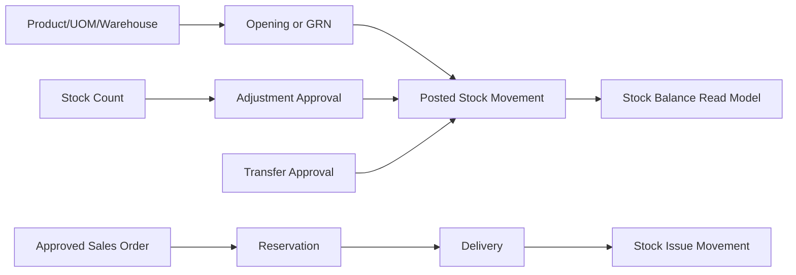
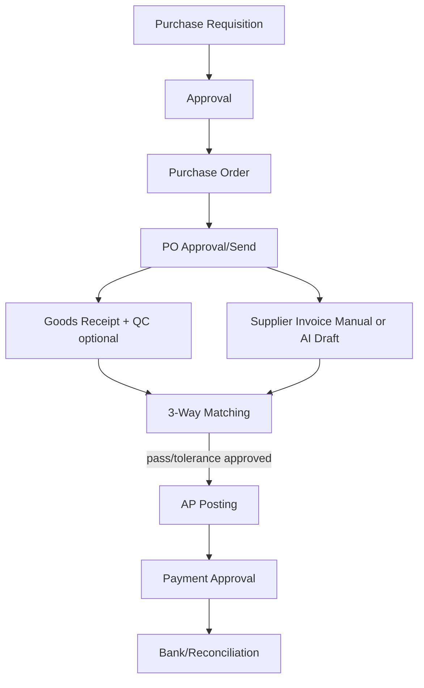
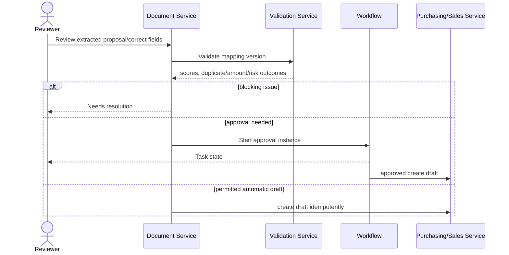

# API, UI and Business Flows

## 1. REST API Convention

Base URL: `/api/v1`. Web requests use authenticated session and CSRF for
mutations; external API authentication is introduced behind the auth adapter.
Every response includes `request_id`; every tenant endpoint derives active
`company_id`/`branch_id` from authorized context rather than request body.

Response envelope:

```json
{
  "data": {},
  "meta": {"request_id": "uuid", "page": 1, "per_page": 25, "total": 1},
  "errors": []
}
```

Mutation requirements:

- `Idempotency-Key` for document upload, posting, payment and integration writes.
- Optimistic `version` or `updated_at` conflict handling on editable drafts.
- `422` validation, `403` policy/tenant denial, `409` duplicate/state conflict,
  `423` period locked, and `429` throttled/tenant quota.

## 2. Endpoint Map

### Tenant, Identity and Administration

| Method / URI | Purpose | Permission |
| --- | --- | --- |
| `GET/POST /login`, `GET /logout`, magic-link policy routes | Shield session flows | public/throttled |
| `GET/POST /account/security/password` | Complete mandatory password replacement; revoke old sessions after save | logged-in valid session |
| `GET /workspace`, `POST /workspace/context` | Available context and switch active company/branch | membership |
| `GET /workspace/modules/{menuCode}` | Placeholder modul dari mapping menu-permission tenant aktif | tenant menu permission |
| `GET/POST /administration/companies` | Tenant administration shell | `platform.company.manage` |
| `GET/POST /administration/branches` | Branch CRUD shell | `platform.company.manage` |
| `POST /administration/users`, `/users/{id}/status`, `/users/{id}/password` | Provision identity, activate/deactivate login, issue force-reset temporary password and revoke old sessions | `platform.company.manage` |
| `GET/POST /administration/access`, `POST /administration/access/revoke`, `/access/company-status`, `/access/branch-status` | Assign/revoke role and administer tenant/branch membership status or switching | `platform.company.manage` |
| `GET /administration/rbac`, `POST /administration/rbac/roles`, `/roles/{id}`, `/permissions`, `/grants`, `/grants/revoke`, `/menu-mappings`, `/menu-mappings/revoke` | Tenant RBAC role status, grants and sidebar menu-permission mapping | `platform.company.manage` |
| `GET /administration/audit` | Auditable activity search | `platform.audit.view` |
| `GET /inventory` | Inventory master/gudang UI tenant aktif | `inventory.stock.view` |
| `POST /inventory/uoms`, `/categories`, `/products`, `/warehouses` | Create master inventory/gudang dalam tenant aktif | `inventory.master.manage` |
| `POST /inventory/products/{id}/status`, `/warehouses/{id}/status` | Activate/deactivate master milik tenant aktif | `inventory.master.manage` |
| `POST /inventory/locations`, `/uom-conversions`, `/item-taxes`, `/batches` | Location, Item UoM Conversion, Item VAT dan Batch Master | `inventory.master.manage` |
| `GET /setup` | Setup Master tenant aktif | `setup.master.view` |
| `POST /setup/departments`, `/transaction-codes`, `/addresses`, `/currencies`, `/tax-codes` | Organization/reference master setup | `setup.master.manage` |
| `GET /sales/master`, `GET /purchasing/master` | Customer/Supplier Commercial Master tenant aktif | `sales.master.view` / `purchasing.master.view` |
| `POST /sales/master/terms`, `/partners`, `/addresses`, `/promotions` | Create customer terms, customer, address link dan promo dasar | `sales.master.manage` |
| `POST /purchasing/master/terms`, `/partners`, `/addresses`, `/promotions` | Create supplier terms, supplier, address link dan promo dasar | `purchasing.master.manage` |
| `POST /sales/master/profiles`, `/purchasing/master/profiles` | Upsert profile/policy, VAT default, warehouse default dan PIC partner | permission `.master.manage` sesuai sisi |

### Masters and Inventory

| Method / URI | Purpose | Permission |
| --- | --- | --- |
| `GET /reference/provinces`, `/reference/regencies`, `/reference/districts`, `/reference/villages` | Dependent address lookup from global Indonesian regional master | authenticated |
| `GET/POST /products`, `/warehouses`, `/suppliers`, `/customers` | REST API master CRUD target; web Inventory master sudah tersedia melalui `/inventory/*` | corresponding `.manage` |
| `GET /inventory/balances` | Paginated/filterable balance | `inventory.stock.view` |
| `GET /inventory/movements` | Ledger drilldown | `inventory.stock.view` |
| `POST /inventory/transfers` | Transfer draft | `inventory.transfer.create` |
| `POST /inventory/transfers/{id}/submit` | Workflow submit | `inventory.transfer.submit` |
| `POST /inventory/adjustments/{id}/post` | Controlled stock posting | `inventory.adjust.post` |

### Purchasing and Sales

| Method / URI | Purpose | Permission |
| --- | --- | --- |
| `GET/POST /purchasing/purchase-orders` | PO list/create | `purchasing.po.*` |
| `POST /purchasing/purchase-orders/{id}/submit` | Start approval | `purchasing.po.submit` |
| `POST /purchasing/goods-receipts` | Receive goods and pending stock post | `purchasing.grn.create` |
| `GET/POST /purchasing/invoices` | AP invoice/draft | `purchasing.invoice.*` |
| `GET/POST /sales/orders` | SO | `sales.order.*` |
| `POST /sales/orders/{id}/deliveries` | Delivery/stock issue | `sales.delivery.create` |
| `POST /sales/invoices/{id}/post` | AR/accounting post | `sales.invoice.post` |
| `POST /pos/shifts`, `/pos/sales` | Cashier operation | `pos.*` |

### Finance, Workflow and Reports

| Method / URI | Purpose | Permission |
| --- | --- | --- |
| `GET/POST /accounting/journals` | Draft/manual journal | `finance.journal.*` |
| `POST /accounting/journals/{id}/post` | Immutable ledger post | `finance.journal.post` |
| `GET/POST /cash-bank/payments` | Incoming/outgoing payments | `bank.payment.*` |
| `POST /cash-bank/reconciliations` | Bank reconciliation | `bank.reconcile` |
| `GET /workflow/tasks`, `POST /workflow/tasks/{id}/act` | Inbox approve/reject | assigned policy |
| `GET /reports/{code}` | Reports/executive analytics | report-specific |
| `GET /notifications`, `POST /notifications/{id}/read` | User inbox | owner |

### AI Document Processing

| Method / URI | Purpose | Permission |
| --- | --- | --- |
| `POST /documents` | Multipart secure upload and enqueue | `documents.upload` |
| `GET /documents` | OCR queue/review list | `documents.view` |
| `GET /documents/{id}` | Metadata, state, preview authorization | `documents.view` |
| `GET /documents/{id}/preview/pages/{page}` | Short-lived protected render | `documents.view` |
| `POST /documents/{id}/reprocess` | Re-run stage/version | `documents.reprocess` |
| `GET /documents/{id}/mapping` | Extracted header/items/confidence/rules | `documents.validate` |
| `PATCH /documents/{id}/mapping` | Save human correction | `documents.validate` |
| `POST /documents/{id}/validate` | Run deterministic rules | `documents.validate` |
| `POST /documents/{id}/draft` | Generate module draft | `documents.create_draft` |
| `GET /ocr/queue/metrics` | Queue dashboard | `documents.monitor` |

Upload response is `202 Accepted` with a document UUID and polling URL. The
server ignores any client request to set `company_id`, AI confidence or posted
transaction ID.

## 3. Skote Presentation Structure

Skote provides layout, Bootstrap 5 styling, theme/dark mode, DataTables and
ApexCharts presentation. Application logic remains in CI4 modules.

```text
app/Views/
|-- layouts/
|   |-- main.php                 # Skote shell, CSP nonce, theme attributes
|   `-- auth.php
|-- partials/
|   |-- sidebar.php              # menu from authorized menu service
|   |-- header.php               # tenant/branch switcher, notification inbox
|   `-- csrf-ajax.php
`-- components/
    |-- datatable.php
    |-- approval_timeline.php
    |-- confidence_badge.php
    `-- document_preview.php

Modules/DocumentProcessing/Views/
|-- index.php                    # queue and metric dashboard
|-- upload.php                   # drag/drop or camera-friendly intake
`-- validate.php                 # split-screen editor
```

### Dashboard Executive

| Widget | Data/API | Visualization |
| --- | --- | --- |
| Revenue, gross margin, AP/AR due | `/reports/executive-summary` | KPI cards/ApexCharts |
| Stock value/low stock/turnover | `/reports/inventory-kpi` | chart + DataTable drilldown |
| PO/Invoice approval backlog | `/workflow/tasks?summary=1` | task cards/timeline |
| OCR status and turnaround | `/ocr/queue/metrics` | stacked chart |
| AI confidence/correction rate | `/reports/document-ai-quality` | trend/distribution |
| Activity timeline | `/audit-logs?recent=1` | authorized timeline |

### OCR Validation Screen

| Panel | Functions |
| --- | --- |
| Upload | Dropzone/Filepond-like component, progress, accepted MIME/page limits |
| Queue list | DataTables server-side status, partner/type/filter, failed retry |
| Preview left | page thumbnail, zoom, highlighted OCR box, page navigation |
| Editor right | header fields, mapped candidates, item grid, confidence badge |
| Validation footer | discrepancy/risk rules, correction notes, approval actions |

AJAX requests send refreshed CSRF tokens and return sanitized JSON only. Preview
URLs are permission checked and expire; original objects are never public URLs.

## 4. Inventory Flow



Rules:

- Balance is updated only from posted immutable movement within a transaction.
- Negative stock is configurable but disabled by default.
- Transfers create outbound then receipt movement, preserving in-transit state.
- Lot/expiry tracking is required for products configured with `track_lot`.

## 5. Purchasing Flow



AI document flow may create `INV` as draft and suggest PO/GRN matching. It
cannot bypass receiving evidence, tolerance rules, workflow, or period lock.

## 6. Sales and POS Flow

Customer order or scanned customer PO generates sales order draft; credit check
and stock reservation precede approval. Delivery posts stock issue. Invoice
posts AR and revenue/tax journal. Receipt/payment closes AR. POS shortens the
path through an open shift, immediate payment and stock issue, but keeps posting
and cashier close reconciliation.

## 7. Accounting Flow

| Source Event | Debit | Credit | Preconditions |
| --- | --- | --- | --- |
| Goods receipt (per policy) | Inventory/GRNI | GRNI liability | accepted quantities |
| Purchase invoice matched | GRNI/Input tax/Expense | Accounts Payable | validation and approval |
| Supplier payment | Accounts Payable | Bank | payment approved |
| Sales delivery/invoice | COGS/AR | Inventory/Revenue + Output tax | stock and credit state |
| Customer payment | Bank | Accounts Receivable | receipt matched |

`PostingService` generates balanced journal entries in one DB transaction with
source status; `debit == credit` and open fiscal period are enforced. Posted
journals are reversed, not edited.

## 8. AI Validation and Approval Flow



## 9. Reusable CRUD Pattern

Every master module exposes list/filter, show, create, update and soft delete
using:

- Server-side DataTables endpoint with allow-listed sort/filter columns.
- Validation request DTO, service policy, repository and API resource.
- `company_id` supplied only by context.
- Audit event and optional outbox event on successful mutation.
- Confirmation modal and permission-controlled UI action; server remains
  authoritative.
