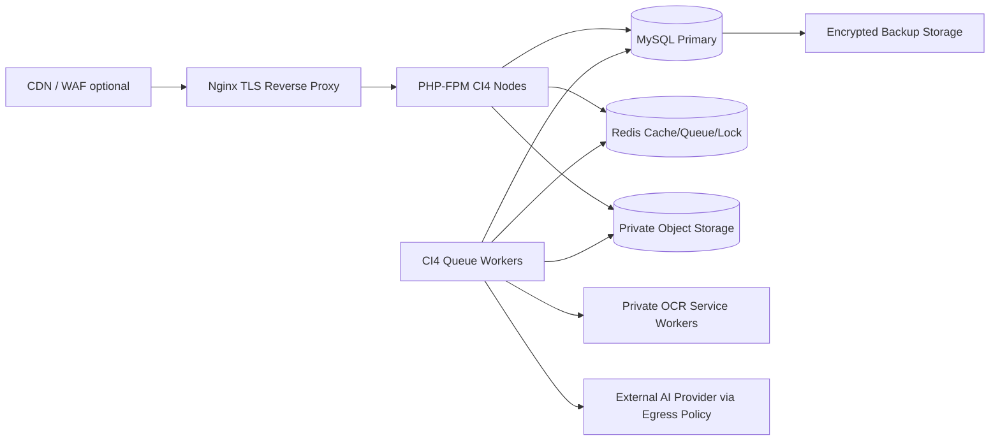

# Deployment, Operations and SaaS Scaling

## 1. Production Topology



Initial single VPS may run Nginx, PHP-FPM, Redis, database and one worker on
separate system services; production growth should separate stateful database
and OCR workloads first.

## 2. Ubuntu Baseline

Recommended OS baseline is an actively supported Ubuntu LTS release chosen at
implementation time. Install and harden:

- Nginx or Apache, PHP-FPM with required CI4 extensions, Composer for release
  build only, MySQL/MariaDB, Redis, Supervisor or systemd, TLS client and backup
  tooling.
- Application releases under `/var/www/pena-erp/releases/<release-id>` and a
  symlink `/var/www/pena-erp/current`; writable runtime and private upload
  volumes are outside release directories.
- Dedicated least-privilege OS users for web app, worker and OCR service.
- UFW/security groups permit only HTTP(S), administrative SSH restriction and
  private service traffic. Database/Redis/OCR are not public.

Configuration/environment categories:

```dotenv
CI_ENVIRONMENT=production
app.baseURL=https://erp.example.com/
database.default.hostname=127.0.0.1
database.default.database=pena_erp
database.default.username=pena_app
redis.host=127.0.0.1
DOCUMENT_STORAGE_DRIVER=s3-private
OCR_SERVICE_URL=http://ocr.internal:8000
AI_PROVIDER=openai
AI_API_KEY=from-secret-manager
```

Secrets belong in a secret manager or protected environment file unreadable by
the web user except at runtime; do not commit them.

## 3. Nginx / Apache Setup

Nginx responsibilities:

- Serve `/public` only, pass `.php` to PHP-FPM, block hidden/config/upload paths.
- Redirect HTTP to HTTPS; enable HSTS after TLS verified; security headers
  including CSP compatible with compiled Skote assets.
- Configure application upload limit aligned with server-side validation and
  client timeouts only for upload intake, not OCR work.
- Emit request ID and structured access logs.

Equivalent Apache deployment must set `DocumentRoot` to `public/`, disable
directory listing, apply HTTPS/security headers and protect writable/private
storage.

TLS uses automated certificate issuance/renewal (for example ACME/Certbot) with
renewal monitoring. Always validate renewal in staging before relying on it.

## 4. Storage and Document Security

| Asset | Location | Access and Retention |
| --- | --- | --- |
| Original upload | private bucket/encrypted volume | Controller-signed access; tenant policy retention |
| Normalized/OCR pages | private derived prefix | Worker + authorized preview only |
| OCR/AI JSON | database + optional encrypted archive | Audit/validation permission |
| Exports | temporary private object | Expiring URL, audit, lifecycle deletion |
| Malware/quarantine file | segregated location | Security/admin only; no OCR |

Backup encrypted documents and database consistently. Restore exercises include
retrieving a linked document after restoring its metadata, not only DB health.

## 5. Worker and OCR Service Deployment

Use systemd or Supervisor to keep worker commands alive:

```ini
[program:pena-document-worker]
command=/usr/bin/php /var/www/pena-erp/current/spark documents:work
directory=/var/www/pena-erp/current
user=pena-worker
numprocs=2
autostart=true
autorestart=true
stopwaitsecs=30
stdout_logfile=/var/log/pena/document-worker.log
stderr_logfile=/var/log/pena/document-worker-error.log
```

OCR service:

- Deploy PaddleOCR/Tesseract in a private container/service with fixed image
  versions, non-root user, CPU/memory/time/page limits and health checks.
- Accept object tokens or streamed internal files, not arbitrary public URLs.
- Enable Indonesian and English language assets; template adds language hints.
- Scale OCR workers independently; GPU is optional after workload profiling.

Worker safety:

- Claim jobs atomically with lease timeout and heartbeat.
- Idempotent stage keys prevent double drafts/posts after retries.
- Dead-letter failures after bounded retries and surface them in dashboard.
- Tenant quotas and priority prevent noisy-neighbor behavior.

## 6. Cron and Scheduled Jobs

| Schedule | Job |
| --- | --- |
| Every minute | Recover expired queue leases and dispatch outbox events |
| Every 5 minutes | Notifications and integration retry |
| Nightly | Backup trigger/verification, archive previews according to retention |
| Daily | KPI/read-model refresh, AI quality metrics, overdue approvals |
| Monthly | Fiscal closing checklist, partition/archive review, restore test schedule |

Prefer persistent worker services for OCR; cron starts scheduled coordination,
not a new expensive OCR process for each document.

## 7. Database, Cache and Performance

| Area | Approach |
| --- | --- |
| Queries | Tenant-leading composite indexes from data catalog; server-side pagination; `EXPLAIN` slow paths |
| Ledger/stock | Transactional posting; retry on deadlock; immutable ledger; read models for dashboard |
| Redis | Menu/RBAC/config cache keyed by company and version; locks; rate limiting; queue |
| Reports | Asynchronous large exports; cached aggregates/materialized read tables as volume grows |
| Frontend | Minified versioned Skote assets; CDN for static public assets only; lazy dashboard widgets |
| Images | Normalize/thumbnail asynchronously; do not ship full scans in queue grids |

Never CDN-cache protected document previews or tenant-sensitive API responses.

## 8. Observability and Incident Response

Required signals:

| Signal | Example Alert |
| --- | --- |
| App/API | 5xx rate, P95 latency, failed logins, permission denials anomaly |
| Queue | oldest queued age, retry/dead-letter growth, stage throughput |
| OCR/AI | processing latency, extraction failure, confidence drift, provider error/cost cap |
| Data | DB storage/replication/slow query, Redis memory, backup/restore verification |
| Security | quarantined uploads, repeated duplicates, context elevation, supplier bank-risk review |

Logs include `request_id`, `company_id`, actor ID, job/document ID and event
type without logging raw sensitive document text. Write operational runbooks for
queue backlog, AI provider outage, restore, credential rotation and data breach
response.

## 9. Backup, Recovery and Data Governance

Initial recovery policy:

- Nightly encrypted full database backup plus binlog/incremental capture
  targeting RPO 15 minutes; copy to a different failure domain.
- Versioned/private storage backup or cross-region replication for documents.
- Backup encryption key managed independently and rotated under documented
  access control.
- Monthly sampled restore and quarterly full disaster recovery exercise.
- Tenant export and retention/deletion workflow must account for audit/legal
  holds and AI correction datasets.

## 10. CI/CD Basic Pipeline

```mermaid
flowchart LR
    PR[Pull Request] --> Static[Lint / Coding Standard / Static Analysis]
    Static --> Unit[Unit + Feature + Tenant Isolation Tests]
    Unit --> Sec[Dependency / Secret / Upload Security Scan]
    Sec --> Build[Composer Production + Frontend Asset Build]
    Build --> Stage[Deploy Staging + Migrate + Smoke]
    Stage --> Approval[Production Approval]
    Approval --> Release[Atomic Release + Migration]
    Release --> Verify[Health / Queue / Rollback Check]
```



Deployment controls:

- Migration is backwards-compatible before application switch; destructive
  schema cleanup occurs in a later release.
- Keep previous release for rollback; migration rollback is separately assessed.
- Do not perform OCR/model rollout without a documented evaluation fixture set
  and versioned prompt/template/model configuration.
- Production access and manual data repairs use audited change procedure.

## 11. SaaS Scaling Strategy

### Scaling Stages

| Stage | Workload Shape | Architecture Move |
| --- | --- | --- |
| Initial | Dozens of companies, moderate documents | Shared DB/schema, single app cluster, Redis queue, isolated OCR workers |
| Growth | High concurrent users and OCR peaks | Horizontal PHP nodes, managed DB/read replica, object storage/CDN static, OCR autoscale |
| Enterprise | Large tenant/legal isolation requirements | Tenant routing, dedicated DB/storage for selected tenants, per-tenant encryption keys |
| Regional | Compliance/latency needs | Region-pinned tenant placement, DR pair, integration gateway |

### SaaS Capabilities to Add

| Capability | Implementation Direction |
| --- | --- |
| Tenant onboarding | provisioning workflow seeds COA/roles/settings/workflow and validates storage keys |
| Plans/quotas | plan and usage tables for users, storage, OCR pages and AI extraction budget |
| Billing | separate bounded context; avoid coupling ledger accounting to SaaS subscription invoices |
| Feature flags | tenant-aware feature configuration with audit |
| Tenant export/offboarding | background export, retention approval, deletion/legal-hold workflow |
| Isolation validation | continuous integration tests and periodic production access review |

## 12. Production Readiness Checklist

- CI4 version, PHP runtime and authentication adapter compatibility are pinned
  and security-reviewed.
- Tenant/branch access, dynamic permission, CSRF, session and audit tests pass.
- Financial posting, reconciliation and inventory concurrency tests pass.
- Secure upload, malware quarantine, OCR container and document preview access
  have security tests.
- OCR/AI extraction evaluation and confidence thresholds approved by business
  owners with manual fallback.
- TLS, backups, restore exercise, secrets, monitoring, queue runbook and incident
  ownership are operational before onboarding real tenants.

